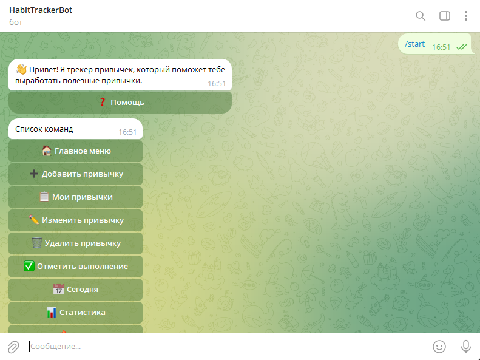
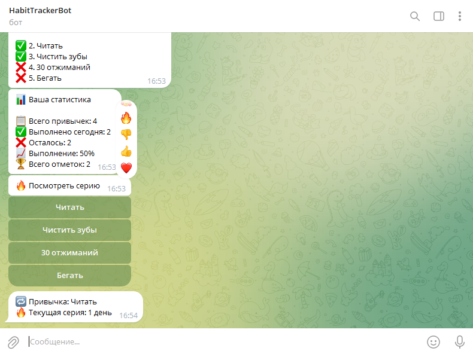
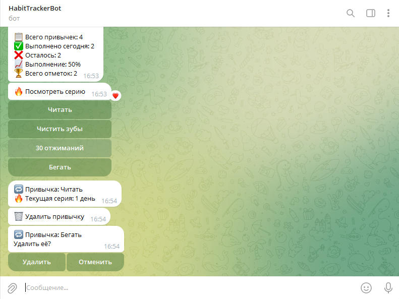

<div align="center">


# 🤖 HabitTrackerBot

### Telegram-бот для отслеживания ежедневных привычек

Помогает формировать полезные привычки, отслеживать прогресс и поддерживать мотивацию.


</div>

---

## 📖 О проекте

**HabitTrackerBot** — это Telegram-бот, разработанный на Python для отслеживания ежедневных привычек.

Проект был создан в учебных целях и позволил изучить работу с базами данных SQLite, SQL-запросами, Telegram Bot API и организацией проекта на несколько модулей.

---

## ✨ Возможности

- ➕ Добавление привычек
- 📋 Просмотр списка привычек
- ✏️ Редактирование привычек
- 🗑️ Удаление с подтверждением
- ✅ Отметка выполнения привычек
- 🚫 Защита от повторного выполнения за один день
- 📅 Просмотр привычек за сегодня
- 📊 Статистика выполнения
- 🔥 Подсчёт текущей серии дней (Streak)
- 🎛️ Полностью интерактивное управление через Inline-кнопки

---

## 🛠 Используемые технологии

- Python
- pyTelegramBotAPI
- SQLite
- SQL
- Git
- GitHub
- python-dotenv

---

## 📸 Скриншоты

### Главное меню



---

### Статистика и серия дней



---

### Удаление привычки



---

## 📁 Структура проекта

```text
HabitTrackerBot/
│
├── assets/
│   └── logo.png
│
├── screenshots/
│   ├── main_menu.png
│   ├── statistics.png
│   └── delete.png
│
├── config.py
├── database.py
├── handlers.py
├── main.py
├── requirements.txt
├── README.md
└── .gitignore
```

---

## 🚀 Установка

### 1. Клонировать репозиторий

```bash
git clone https://github.com/nurali22-WR/telegram-habit-tracker-bot.git
```

### 2. Перейти в папку проекта

```bash
cd telegram-habit-tracker-bot
```

### 3. Установить зависимости

```bash
pip install -r requirements.txt
```

### 4. Создать файл `.env`

```env
TOKEN=ВАШ_ТОКЕН_БОТА
```

### 5. Запустить бота

```bash
python main.py
```

---

## 🎯 Что было изучено в ходе разработки

Во время создания проекта были освоены:

- Работа с SQLite
- CRUD-операции
- SQL-запросы
- Работа с несколькими таблицами
- Callback Query
- Inline-клавиатуры
- Работа с датами
- Подсчёт статистики
- Алгоритм вычисления текущей серии дней
- Организация проекта на несколько файлов
- Работа с Git и GitHub

---

## 🚀 Возможные улучшения

В будущем проект можно расширить:

- 🔔 Напоминания о привычках
- ☁️ Переход на PostgreSQL
- 🌐 Собственный REST API
- 📈 Более подробная аналитика
- 🐳 Docker
- 🌍 Веб-интерфейс

---

## 👨‍💻 Автор

Проект разработан в образовательных целях для изучения Python, SQLite и разработки Telegram-ботов.